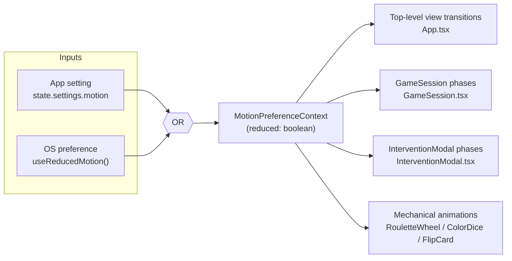
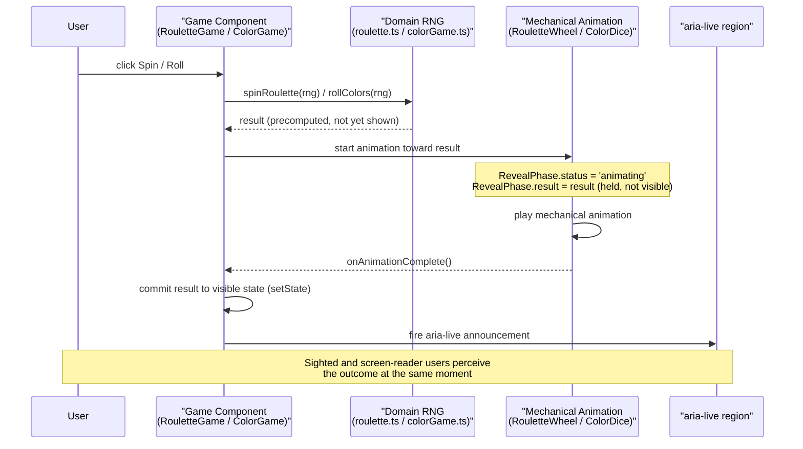

# Design Document: UI Motion & Transitions

## Overview

G.A.M.E. (Gambling Awareness Manic Education) is a no-real-money, browser-based gambling-awareness education app built with React 19, TypeScript, and Vite. Every view switch, modal phase, and game outcome currently renders as an instant hard cut: `App.tsx` swaps views with a plain conditional render, `InterventionModal.tsx` swaps phases the same way, and outcomes (dice rolls, roulette spins, card deals) appear fully resolved in the same render as the wager. There is no animation library and no shared timing/easing tokens anywhere in the codebase. `src/styles.css` contains exactly two isolated CSS effects — the `breathe` keyframe animation on `.breathing-orb` (the paced-breathing tool) and a short `translate`/`border-color` transition on `.tongits-card` — plus a blanket `prefers-reduced-motion: reduce` media query that collapses all animation/transition durations to near-zero.

This feature introduces a systematic, reusable phase-in/out animation foundation for the whole app, and pairs it with literal mechanical simulations for the 5 casino-style learning games (Roulette, Color Game, Blackjack, Poker, Tong-its): a spinning roulette wheel, tumbling color dice, and flipping playing cards, replacing the instant-result rendering that exists today. This is the first of two sequential UX features. A later, separately designed feature adds AI bot "thinking" delays and a companion-bettor bot to the games; that feature is expected to reuse this feature's wheel/dice spin timing as a fixed constant rather than retuning it, so the timing tokens defined here should be treated as a stable contract, not an incidental implementation detail. Both UX features precede an eventual mobile layout overhaul, which is out of scope for this design.

## Goals

- Establish one consistent motion language used app-wide, rather than ad hoc, per-component animation choices.
- Respect reduced-motion preference by *compressing* durations toward-instant, not by branching to an entirely different, unanimated code path — the same enter/exit structure runs for every user, just faster.
- Adopt Motion (npm package `motion`, imported from `motion/react`) as the single animation engine for the app. Motion is the renamed successor to `framer-motion` (the package name and import path changed; the API carries forward). It will be pinned to an exact version in `package.json` rather than a caret/tilde range.
- Deliver literal mechanical animations — a rotating roulette wheel, tumbling/settling dice, flipping cards — not just opacity/position fades standing in for game outcomes.
- Leave the pure domain game-rule modules (`blackjack.ts`, `poker.ts`, `tongits.ts`, `roulette.ts`, `colorGame.ts`) untouched. These modules stay deterministic, side-effect-free, and animation-agnostic; every animation concern lives in the UI layer (`src/components/`) and a new `src/motion/` module.

## Architecture

This feature introduces a new `src/motion/` module that sits between the app's two motion-preference *inputs* and all of its UI *consumers*:

- **Inputs**: the app's own persisted setting (`state.settings.motion`, already surfaced today as the "Reduced motion" toggle in Settings) and the OS-level `prefers-reduced-motion` signal, read through Motion's `useReducedMotion()` hook rather than a hand-rolled media-query listener.
- **Consumers**: top-level view switching in `App.tsx`, the phase transitions in `GameSession.tsx` and `InterventionModal.tsx`, the onboarding flow in `Onboarding.tsx`, and the 5 game components — plus the 3 new mechanical animation pieces (roulette wheel, color-game dice, and a shared flip-card).

The two inputs combine with OR logic (either source asking for reduced motion wins) into a single boolean exposed through a `MotionPreferenceContext`, so every consumer reads one already-combined value instead of re-deriving it.



Every consumer reads the combined preference from context; none of them inspect `state.settings.motion` or the media query directly. This keeps the OR logic in exactly one place, and means a future additional input would only change `MotionPreferenceContext`, not every consumer.

## Components and Interfaces

### Module breakdown

New pieces introduced by this feature, all under `src/motion/` unless noted otherwise:

- **`src/motion/tokens.ts`** — duration and easing constants, organized into three tiers: view-level transitions (~200-250ms fade+rise), small element-level transitions (~150ms), and mechanical animations (~1.5-3s) for the wheel, dice, and card flips.
- **`src/motion/useMotionPreference.ts`** — the hook that reads `state.settings.motion` and Motion's `useReducedMotion()`, OR-combines them, and is the sole source feeding `MotionPreferenceContext`.
- **`src/motion/variants.ts`** — shared Motion variant objects reused across consumers: fade+rise enter/exit variants for the view/element tiers, and a fast-fade variant substituted in when motion is reduced.
- **`src/motion/MotionPreferenceContext.tsx`** — the React context provider that wraps `useMotionPreference()` and is mounted once in `App.tsx`, plus the consumer hook/component read by everything downstream.
- **`RouletteWheel`** — new component/module rendering the mechanical spinning-wheel animation for the Roulette game.
- **`ColorDice`** — new component/module rendering the tumbling-dice animation for the Color Game.
- **`FlipCard`** — new shared component rendering a card flip, reused by Blackjack, Poker, and Tong-its wherever a card is dealt or revealed.

Pure domain modules under `src/domain/` and `src/domain/games/` are **not** touched by this feature — they remain plain data/rule functions with no knowledge of animation, timing, or motion preference.

## Data Models

The following are design-level shapes to establish shared vocabulary for requirements and Low-Level Design — exact field names, generics, and file placement may be refined later.

**`MotionPreference`** — the single combined value carried by `MotionPreferenceContext` (see Architecture above); it is the OR-combination of the app setting and the OS signal, not either input individually.

```typescript
interface MotionPreference {
  reduced: boolean
}
```

**`MotionTier`** — the key used to look up a duration/easing pair in `src/motion/tokens.ts`; every consumer picks a tier instead of hardcoding a duration.

```typescript
type MotionTier = 'view' | 'element' | 'mechanical'
```

**`NavigationDirection`** — derived per view change in `App.tsx` and passed to `AnimatePresence`'s `custom` prop (see "Direction-aware transitions model" below).

```typescript
type NavigationDirection = 'forward' | 'backward'
```

Heuristic (`App.tsx` only): `View` is a flat union with `'home'` as the sole hub and no nested router/stack, so direction is defined purely by the destination:
- navigating **to** `'home'` → `'backward'`
- navigating **to** any other view → `'forward'`

**`RevealPhase`** — local state shape for mechanical-animation components (`RouletteWheel`, `ColorDice`, and any future one) that hold a precomputed result while the animation plays, before it is committed to visible/announced state.

```typescript
interface RevealPhase<T> {
  status: 'idle' | 'animating' | 'revealed'
  result: T | null
}

// Example instantiations:
type RouletteReveal = RevealPhase<number>                   // winning pocket, 0–36
type ColorReveal = RevealPhase<[ColorId, ColorId, ColorId]> // 3 rolled dice faces (ColorId from src/domain/games/colorGame.ts)
```

## Sequence diagram: compute now, animate, reveal on finish



This compute-now / animate / reveal-on-finish shape is deliberately generic, not specific to roulette or color outcomes. The later AI-bot-thinking feature referenced in the Overview is expected to reuse the identical shape for bot decisions — the bot's move is computed immediately, and only its reveal (the thinking-delay animation) is deferred, exactly as the wheel/dice result sits in `RevealPhase` here before being committed and announced.

## Direction-aware transitions model

`App.tsx` currently holds a single `view: View` value with no memory of what the previous view was. To derive `NavigationDirection` on each change, it needs to track the previous view alongside the current one — most simply a `useRef<View>` updated after each transition, or a small `{ current, previous }` state shape — so the outgoing view is still known at the moment a new one is set.

On every `view` change, the previous and next values are compared using the `'home'`-is-back heuristic above to produce one `NavigationDirection`. That value is passed as the `custom` prop on the `AnimatePresence` wrapping the view content, making it available to whichever exit/enter variant is active so the two can differ by direction — conceptually, forward navigation exits the outgoing view up and out while the incoming view falls in from the opposite side, and backward navigation mirrors that pairing. The exact variant objects, offsets, and easing values are left to Low-Level Design; this chunk only establishes that direction is computed once in `App.tsx` and threaded through as data, not decided inside individual view components.

## Accessibility considerations

The app already has five confirmed `aria-live` / live-region markers wired to game outcomes, and this feature preserves every one of them exactly as markup — only the timing of the state write feeding them changes:

- Roulette: the `.roulette-result` region in `RouletteGame.tsx` (explicit `aria-live="polite"`)
- Color Game: the `.color-dice` region in `ColorGame.tsx` (explicit `aria-live="polite"`)
- Poker: the `.poker-outcome` paragraph in `PokerGame.tsx` (explicit `aria-live="polite"`)
- Tong-its: the `.round-win` result paragraph in `TongitsGame.tsx` (explicit `aria-live="polite"`)
- Blackjack: the `.blackjack-outcome` banner in `BlackjackGame.tsx` — this one is `role="status"` rather than an explicit `aria-live` attribute, which is an ARIA-equivalent implicit polite live region, not a discrepancy this feature needs to fix

This feature does not touch any of these attributes, roles, or the surrounding markup. What moves is only *when* the underlying result state is written — from immediately-on-click today to the animation-complete callback in the reveal-timing sequence (previous chunk) — so a screen-reader user hears the announcement at the same moment a sighted user sees the wheel/dice/cards settle, instead of hearing it while the animation is still visually in progress.

Reduced motion is deliberately not a total skip for the three mechanical animations (wheel spin, dice tumble, card flip), only a compressed duration, because each one is communicating a real outcome, not decoration. Skipping them outright would either surface the result with no perceivable process at all, or force a second, un-animated code path — something Goals already rules out ("respect reduced-motion preference by *compressing* durations toward-instant, not by branching to an entirely different, unanimated code path"). The `mechanical` tier in `src/motion/tokens.ts` (Module breakdown) applies under both preference states; only the duration value it resolves to changes. Pure decorative view/phase transitions — the fade+rise pattern used for `App.tsx` view switches and `GameSession`/`InterventionModal` phase changes — carry no outcome information, so for those, collapsing toward a fast, near-instant fade (the fast-fade variant already named in `src/motion/variants.ts`, Module breakdown) is sufficient and matches the negotiated requirement.

Worth restating precisely because it's an easy integration mistake with Motion: `useReducedMotion()` only ever reflects the OS-level `prefers-reduced-motion` signal — it has no awareness of this app's own `state.settings.motion` toggle. That's exactly why the Architecture section routes both inputs through `MotionPreferenceContext` with OR logic instead of letting individual consumers call `useReducedMotion()` inline. Every consumer must read the combined value from context; a component that reached for `useReducedMotion()` directly would silently ignore users who rely solely on the in-app "Reduced motion" setting in Settings, rather than the OS setting.

Focus management is flagged here as an open concern rather than resolved: when a view or modal animates out while its replacement animates in, focus must not be left on a detached or hidden element, and it must not sit idle waiting for the exit/enter animation to visually finish before moving. Concretely, focus should land on the new view's heading or first focusable element as soon as that view mounts, decoupled from `AnimatePresence`'s exit-animation timeline. The exact mechanism — how a mount-time focus move interacts with `AnimatePresence` exit-before-enter sequencing, and which element in each view/modal is the intended focus target — is left to Low-Level Design.

## Test impact

Motion animations resolve asynchronously — even under Vitest/jsdom, where Motion still runs its animation loop rather than completing synchronously. Any assertion that checks post-outcome state in the same synchronous tick as the triggering render or click can no longer reliably observe it, because that state write is now deferred behind an animation-complete callback instead of happening in the same render as the click handler.

Two existing assertions in `App.test.tsx` are known to be affected:

- `'deals a poker hand without crashing before five cards are available'` deals a hand and, in the same synchronous flow, checks that the `Community board` region already shows `Preflop`.
- `'interrupts rapid repeated roulette wagers'` fires three spin clicks back-to-back and immediately expects the intervention dialog to be present.

Both currently rely on the result/board or intervention state being available synchronously; once outcomes are gated behind the animation-complete callback, both need to move to async-aware queries (`findBy*` or `waitFor`) instead of the synchronous `getBy*` assertions they use today.

More broadly, per-game component-level assertions for Blackjack, Poker, Tong-its, Roulette, and Color Game — wherever they exist today or get added/touched going forward — will need the same async-aware treatment anywhere they check a result, outcome banner, or newly-dealt card, since all of those are now committed after an animation-complete callback rather than in the same render as the triggering action.

Domain-level tests are unaffected and stay exactly as they are: `blackjack.test.ts`, `poker.test.ts`, `tongits.test.ts`, `roulette.test.ts`, and `colorGame.test.ts` exercise the pure `src/domain/games/` rule modules, which this feature does not touch — they remain fully synchronous.

Exact test code, shared helper utilities, or a fake-timer strategy for driving Motion's animation loop in tests are deferred to the tasks/implementation phase. This section only establishes which existing assertions break and where the same class of problem will recur, not how it gets fixed.

## Error Handling

- **Negative duration passed to `compress()`** — `compress()` declares `duration >= 0` as a precondition; callers are responsible for honoring it. It is not defended against inside the function.
- **`useMotionPref()` called outside `MotionPreferenceProvider`** — throws an error naming the missing provider rather than silently defaulting to full or reduced motion, so a genuine wiring mistake in a new component surfaces immediately instead of being masked.
- **`useReducedMotion()` returning a non-strict-boolean** — the OS media query may not have resolved yet. The comparison is `prefersReducedOS === true` rather than a truthy check, so an unresolved OS state resolves to full motion and never accidentally forces `reduced: true`.
- **Idle / null target in `RouletteWheel`** — with `target === null` the spin effect returns early: current rotation is retained, no animation starts, and `onSettled()` is never invoked.
- **Idle / null targets in `ColorDice`** — with `targets === null` the component renders three placeholder dice, applies no animation and no step advancement, and invokes no settle callback.
- **Settle callback with no held outcome** — `handleSettled()` in both `RouletteGame` and `ColorGame` guards on `pendingResult`/`pendingRoll` being non-null and returns immediately otherwise, so no wallet change, no event, and no visible-outcome change occur.
- **Focus on detached or hidden content** — flagged as an open concern under Accessibility considerations: focus must move to the newly mounted content rather than remaining on an element removed or hidden by an exit animation. The exact mechanism is left to Low-Level Design.

## Testing Strategy

Summarizing what the Test impact section above establishes, without adding new commitments:

- **Async-aware component assertions** — any assertion on an animation-gated state commit (game results, outcome banners, newly dealt cards, intervention dialogs) uses `findBy*` or `waitFor` rather than synchronous `getBy*`, because those writes are now deferred behind an animation-complete callback.
- **The two known-affected `App.test.tsx` cases** — `'deals a poker hand without crashing before five cards are available'` and `'interrupts rapid repeated roulette wagers'` both move to async-aware queries.
- **Domain tests stay synchronous** — `blackjack.test.ts`, `poker.test.ts`, `tongits.test.ts`, `roulette.test.ts`, and `colorGame.test.ts` exercise untouched pure modules and remain fully synchronous, with no timer advancement or awaits.
- **Property-based testing** — the Correctness Properties below are the targets for property-based tests, covering token shape and derivation, `compress()` behavior and the mechanical floor, preference OR-combination and reference stability, direction resolution, phase derivation, and rotation/step accumulation.
- **Deferred to implementation** — exact test code, shared helpers, and any fake-timer strategy for driving Motion's animation loop.

## Correctness Properties

*A property is a characteristic or behavior that should hold true across all valid executions of a system — essentially, a formal statement about what the system should do. Properties serve as the bridge between human-readable specifications and machine-verifiable correctness guarantees.*

### Property 1: Token shape is well-formed for every tier

*For any* Motion tier token, and for the card-flip token, the reduced-motion duration is greater than 0 and less than or equal to the full duration, and an easing value is present.

**Validates: Requirements 1.3, 2.2**

### Property 2: Reduced durations are derived, never hand-written

*For any* token exposed by the Motion tokens module, its reduced-motion duration equals `compress(fullDuration, true)`.

**Validates: Requirements 1.5, 2.9**

### Property 3: Full motion is never altered

*For any* non-negative duration, `compress(duration, false)` returns that exact duration.

**Validates: Requirements 2.1**

### Property 4: Reduced motion never lands slower

*For any* non-negative duration, `compress(duration, true)` returns a value in the closed interval from 0 to that duration.

**Validates: Requirements 2.2**

### Property 5: Curated pairs win, otherwise ratio and rounding

*For any* non-negative duration, `compress(duration, true)` returns the curated paired value when the duration is a key of the curated table, and otherwise returns the duration scaled by the fallback ratio and rounded to the nearest whole millisecond, subject to the mechanical floor.

**Validates: Requirements 2.3, 2.4**

### Property 6: Mechanical-scale animations never collapse to instant

*For any* duration greater than or equal to the mechanical-scale minimum, `compress(duration, true)` returns a value greater than or equal to `MECHANICAL_FLOOR_MS`, so the wheel, dice, and card flip always remain perceivable.

**Validates: Requirements 2.5, 2.7**

### Property 7: Variant selection follows the reduced flag

*For any* value of the combined reduced flag, a decorative-transition consumer selects the fast-fade variant exactly when the flag is true and the fade-and-rise variant otherwise, and the fast-fade variant animates opacity with no vertical offset.

**Validates: Requirements 2.8, 4.12, 5.4**

### Property 8: Motion preference is the OR of its two inputs

*For any* app motion setting value and *any* OS reduced-motion signal value, including undefined, null, and non-boolean values, the resolved preference has `reduced` true exactly when the setting equals `'reduced'` or the signal is the strict boolean `true`, and resolving never throws.

**Validates: Requirements 3.1, 3.2**

### Property 9: Preference identity is stable and updates propagate

*For any* sequence of renders in which neither input changes, the preference object reference is identical across those renders; and *for any* change to either input, the next render supplies a preference matching the OR rule for the new input values.

**Validates: Requirements 3.3, 3.9**

### Property 10: Navigation direction is a pure function of the destination

*For any* `View` value, and *for any* order in which views are visited, the resolved navigation direction is `'backward'` exactly when the destination is `'home'` and `'forward'` otherwise, depending on no other state.

**Validates: Requirements 4.1, 4.2, 4.3, 4.12**

### Property 11: Direction-aware variant is a mirrored pair with a neutral rest state

*For any* navigation direction, the entering vertical offset and the exiting vertical offset have opposite signs, the resting state is full opacity at zero offset, and the transition duration and easing come from the `view` tier token.

**Validates: Requirements 4.5, 4.6, 4.9**

### Property 12: View navigation converges on exactly the newest destination

*For any* sequence of navigation requests, including repeats of the current view and requests issued while a transition is still running, once animations settle exactly one view container is mounted, it corresponds to the last requested destination, and it rests at full opacity and zero vertical offset.

**Validates: Requirements 4.7, 4.10, 4.11**

### Property 13: Session phase is a total function of its three inputs

*For any* combination of acknowledged flag, session end time, and remaining seconds — including null end times and non-positive or non-finite second values — exactly one phase of `confirm`, `active`, or `complete` is derived, resolving to `confirm` when the flag is false or the end time is unset, to `complete` once the remaining seconds reach zero or below, and to `active` otherwise, without an uncaught error.

**Validates: Requirements 5.1, 5.2**

### Property 14: One keyed container is mounted per animated region

*For any* session phase input triple, and *for any* intervention phase sequence, exactly one keyed phase container is mounted at rest in the session view and in the modal respectively, and the container's `phase-{phase}` class encodes the same phase value used as its animation key.

**Validates: Requirements 5.3, 5.8, 5.9**

### Property 15: Phase transitions queue rather than overlap

*For any* interleaving of timer-driven or dismiss-driven phase changes with an in-flight enter or exit animation, at most one pending phase transition is applied, it begins only after the in-flight exit completes, earlier superseded pending values are discarded, and content stays mounted until its exit finishes.

**Validates: Requirements 5.5, 5.6, 5.11**

### Property 16: Wheel layout is an authentic evenly spaced permutation

*For any* pocket in the wheel order, the order is a permutation of the integers 0 through 36 that is not ascending numeric order, adjacent pockets are separated by an equal angular span, and the pocket's colour equals `rouletteColor(number)`.

**Validates: Requirements 6.1, 6.2**

### Property 17: Rotation accumulates forward and lands on the target

*For any* sequence of target pockets, including a target repeating the immediately previous result and increments issued mid-animation, each spin increases cumulative rotation by at least one full rotation and the resulting rotation modulo 360 aligns the target pocket to the marker.

**Validates: Requirements 6.3, 6.5, 6.9**

### Property 18: Spin magnitude reflects the motion preference

*For any* target pocket, the spin adds five extra full rotations at full motion and two at reduced motion, over the mechanical-tier duration and its compressed counterpart respectively, so the reduced spin is strictly shorter in both rotation count and duration.

**Validates: Requirements 6.6, 6.7**

### Property 19: Dice steps accumulate forward and land on their target faces

*For any* sequence of three-face target rolls, including repeated faces and increments issued mid-tumble, each die's step count increases by at least one full face cycle per roll and each die's final step maps to exactly one visible face equal to its target face.

**Validates: Requirements 7.1, 7.3, 7.4, 7.9, 7.11**

### Property 20: Tumble magnitude reflects the motion preference

*For any* target roll, each die advances four additional full face cycles at full motion and two at reduced motion, over the mechanical-tier duration and its compressed counterpart respectively.

**Validates: Requirements 7.5, 7.6**

### Property 21: Settle fires exactly once per animation round

*For any* sequence of spin-token increments with valid targets, and *for any* order in which the three dice complete, the settle callback is invoked exactly once per round, only after the last constituent animation completes, with no completion carried over from a previous round.

**Validates: Requirements 6.8, 7.7, 7.8**

### Property 22: Outcome reveal parity between sighted and announced output

*For any* game outcome in Roulette or Color Game, from the moment a round starts until the settle callback fires, the rendered outcome text and the live-region content are unchanged from their pre-round values and contain no value derived from the held outcome; the visible outcome changes only in response to the settle callback, and every rendered or announced outcome value is read from the visible state rather than the held state.

**Validates: Requirements 8.1, 8.2, 8.5, 8.6, 8.7**

### Property 23: Wager is committed on placement, payout on settle

*For any* valid stake and outcome, the wallet is debited by exactly the stake and one bet-placed event is emitted within the round-start handler, and the payout credit, the round-resolved event, and the lesson-ready flag occur exactly once, on settle, matching the pure domain settlement result for that outcome.

**Validates: Requirements 8.3, 8.4, 8.10**

### Property 24: Animated regions sit outside the announcing live region

*For any* of the two mechanical games, no ancestor of the animated wheel or dice region is the live region that announces that game's outcome.

**Validates: Requirements 8.9**

### Property 25: Displayed card face matches the latest revealed state

*For any* card label and *any* sequence of revealed-state toggles, including toggles issued while a rotation is in flight, the entrance rotation runs from the edge-on angle to the resting angle, and the front face settles at the angle corresponding to the last revealed value.

**Validates: Requirements 9.3, 9.4, 9.5, 9.11**

### Property 26: Deal token replays the entrance

*For any* sequence of deal-token increments, each increment restarts the entrance rotation from the edge-on angle.

**Validates: Requirements 9.6**

### Property 27: Card flip timing comes only from the card-flip token

*For any* value of the reduced flag, the flip's resolved duration equals the card-flip token's corresponding full or reduced duration, and both the entrance and reveal rotations still run rather than being skipped.

**Validates: Requirements 9.7, 9.10**

### Property 28: Domain rule modules stay pure and synchronous

*For any* seeded input to a domain game-rule function, repeated calls return equal results synchronously, with no deferred work scheduled and no motion or timing input consulted.

**Validates: Requirements 10.1**

### Property 29: Focus lands on live content and never on hidden content

*For any* sequence of view or modal mounts, focus moves to the newly mounted content's heading or first focusable element without waiting for the outgoing exit animation, and after each transition the focused element is attached to the document and visible.

**Validates: Requirements 10.6, 10.7**

# Low-Level Design

This section implements the modules from the High-Level Design's "Module breakdown" with concrete TypeScript. It's being written incrementally, in the same dependency order the rest of `src/motion/` builds on: tokens first, then the preference-detection hook, then the context that exposes it app-wide. Later chunks cover `variants.ts`, the `App.tsx` navigation/direction wiring, and the mechanical animation components.

## `src/motion/tokens.ts`

Duration and easing constants for the three `MotionTier` values, plus a card-flip sub-case that shares the `mechanical` tier conceptually but runs at a different concrete duration than the wheel/dice baseline — a flip is a fast reveal, not a multi-second spin. The High-Level Design's "~1.5-3s" mechanical estimate was sized around the wheel/dice case; card flip is refined here as its own constant rather than forced into that range. Reduced-motion values are curated per token rather than computed from one global ratio, because a single ratio applied uniformly would produce inconsistent-feeling results across tiers of such different scale (a 220ms fade and a 2400ms spin shouldn't compress by the same percentage). The curated pairs are the single source of truth — `MOTION_TOKENS` derives its `reducedDuration` fields by calling `compress()` rather than hardcoding a second, independently-drifting number.

```typescript
export type MotionTier = 'view' | 'element' | 'mechanical'
export type MotionEase = number[] | string

export interface MotionToken {
  duration: number
  reducedDuration: number
  ease: MotionEase
}

const EASE_DECORATIVE: MotionEase = [0.22, 1, 0.36, 1] // gentle ease-out; fade+rise view/element transitions
const EASE_MECHANICAL: MotionEase = [0.65, 0, 0.35, 1] // pronounced ease-in-out; spins/tumbles/flips settling into place

// Mechanical animations (wheel spin, dice tumble, card flip) represent a real outcome, not
// decoration. Per the design's Accessibility section, reduced motion may compress them but must
// never let them collapse to an instant, imperceptible swap. This is the floor `compress()`
// enforces for any duration it treats as mechanical-scale — it never fully skips the animation.
export const MECHANICAL_FLOOR_MS = 150

const MECHANICAL_MIN_MS = 400 // durations at/above this are assumed mechanical-scale by compress()'s fallback path
const FALLBACK_REDUCED_RATIO = 0.4

// Curated (full -> reduced) pairs for every duration defined below. compress() returns these
// exactly; the ratio/floor fallback only runs for a duration that isn't curated here yet.
const REDUCED_DURATION_MS: Record<number, number> = {
  220: 90, // view
  150: 80, // element
  2400: 900, // mechanical: wheel spin / dice tumble
  450: 150, // mechanical: card flip
}

/**
 * Scales a duration down under reduced motion. Known durations (curated above) return their
 * exact paired value; anything else falls back to a flat ratio, floored so a mechanical-scale
 * duration can never compress below MECHANICAL_FLOOR_MS.
 *
 * Preconditions: `duration >= 0`.
 * Postconditions:
 *  - `reduced === false` implies result `=== duration` (full motion is never altered).
 *  - `reduced === true` implies result `<= duration` (reduced motion never lands slower).
 *  - `reduced === true && duration >= MECHANICAL_MIN_MS` implies result `>= MECHANICAL_FLOOR_MS`.
 */
export function compress(duration: number, reduced: boolean): number {
  if (!reduced) return duration
  const curated = REDUCED_DURATION_MS[duration]
  if (curated !== undefined) return curated
  const scaled = Math.round(duration * FALLBACK_REDUCED_RATIO)
  return duration >= MECHANICAL_MIN_MS ? Math.max(MECHANICAL_FLOOR_MS, scaled) : scaled
}

export const MOTION_TOKENS: Record<MotionTier, MotionToken> = {
  view: { duration: 220, reducedDuration: compress(220, true), ease: EASE_DECORATIVE },
  element: { duration: 150, reducedDuration: compress(150, true), ease: EASE_DECORATIVE },
  // wheel spin / dice tumble baseline
  mechanical: { duration: 2400, reducedDuration: compress(2400, true), ease: EASE_MECHANICAL },
}

// Card flip is mechanical-tier by category (real outcome, same floor rule) but not the
// wheel/dice baseline duration, so it's a sibling constant rather than a 4th MOTION_TOKENS key —
// MotionTier stays the 3-value union defined in the High-Level Design's data model.
export const CARD_FLIP_TOKEN: MotionToken = {
  duration: 450,
  reducedDuration: compress(450, true),
  ease: EASE_MECHANICAL,
}
```

## `src/motion/useMotionPreference.ts`

Combines the OS signal with the app's own setting. The codebase has no existing context or hook that exposes `state.settings` outside `App.tsx` — `useAppState()` returns `{ state, dispatch }` directly, and every consumer today receives `state` via prop-drilling rather than context (there is no `createContext` anywhere in `src/` yet). So this hook takes `settingsMotion` as a plain argument, the simpler of the two options named in scope, rather than reading from an app-state context that doesn't exist. `MotionPreferenceProvider` (next section) is the sole caller and supplies the argument from `state.settings.motion`.

```typescript
import { useMemo } from 'react'
import { useReducedMotion } from 'motion/react'
import type { MotionLevel } from '../domain/types'

/** The single combined signal every consumer reads (see design's Architecture section). */
export interface MotionPreference {
  reduced: boolean
}

/**
 * OR-combines the app's persisted `settings.motion` toggle with the OS-level
 * `prefers-reduced-motion` signal into one MotionPreference.
 *
 * Preconditions: none beyond `settingsMotion` being a valid MotionLevel.
 * Postconditions: `reduced === true` iff `settingsMotion === 'reduced'` OR the OS reports
 * reduced motion. The returned object is referentially stable across renders where neither
 * input changed.
 */
export function useMotionPreference(settingsMotion: MotionLevel): MotionPreference {
  const prefersReducedOS = useReducedMotion()

  return useMemo<MotionPreference>(
    () => ({ reduced: settingsMotion === 'reduced' || prefersReducedOS === true }),
    [settingsMotion, prefersReducedOS],
  )
}
```

`prefersReducedOS === true` (rather than a bare truthy check) is deliberate: it stays correct even if a given Motion version's `useReducedMotion()` briefly returns something other than a strict boolean before the OS media query resolves, so an unresolved OS state never accidentally forces `reduced: true`.

## `src/motion/MotionPreferenceContext.tsx`

Wraps the hook in a provider so every consumer reads one already-combined value instead of each independently calling `useMotionPreference()` and re-supplying `settingsMotion`. The raw context object stays module-private; only the provider and the consumer hook are exported.

```tsx
import { createContext, useContext, type ReactNode } from 'react'
import { useMotionPreference, type MotionPreference } from './useMotionPreference'
import type { MotionLevel } from '../domain/types'

const MotionPreferenceContext = createContext<MotionPreference | undefined>(undefined)

interface MotionPreferenceProviderProps {
  settingsMotion: MotionLevel
  children: ReactNode
}

export function MotionPreferenceProvider({ settingsMotion, children }: MotionPreferenceProviderProps) {
  const preference = useMotionPreference(settingsMotion)
  return <MotionPreferenceContext.Provider value={preference}>{children}</MotionPreferenceContext.Provider>
}

/**
 * Consumer hook. Throws if called outside MotionPreferenceProvider rather than silently
 * defaulting to full or reduced motion — a silent default could mask a genuine wiring mistake
 * in a new component.
 */
export function useMotionPref(): MotionPreference {
  const context = useContext(MotionPreferenceContext)
  if (context === undefined) {
    throw new Error('useMotionPref must be used within a MotionPreferenceProvider')
  }
  return context
}
```

**Mount point in `App.tsx`:** the provider needs to wrap both of `App`'s existing return points, not just the main one — `Onboarding.tsx` is listed as a motion consumer in the Architecture section, so the pre-onboarding branch needs the context too:

```tsx
export function App() {
  const { state, dispatch } = useAppState()
  // ...existing view / activeLesson state...

  if (!state.onboarded) {
    return (
      <MotionPreferenceProvider settingsMotion={state.settings.motion}>
        <Onboarding onComplete={() => dispatch({ type: 'complete_onboarding' })} />
      </MotionPreferenceProvider>
    )
  }

  return (
    <MotionPreferenceProvider settingsMotion={state.settings.motion}>
      <main className={`app-shell theme-${state.settings.theme} ...`}>
        {/* ...existing phone-frame, bottom-nav, InterventionModal... */}
      </main>
    </MotionPreferenceProvider>
  )
}
```

The rest of `App.tsx` — `AnimatePresence`, direction computation, the view-switch JSX itself — is unchanged in this snippet and left to the chunk that covers navigation.

## `src/motion/variants.ts` (base variants)

`resolveTransition` divides by 1000 because `tokens.ts` stores durations in milliseconds while Motion's `Transition.duration` expects seconds. `fadeRise` and `fastFade` are both plain `Variants` objects rather than one self-branching variant — a consuming component reads `useMotionPref().reduced` and picks which of the two to pass to its `motion.div`, so the reduced/full branch lives at the call site, not baked into these definitions. A third, direction-aware variant for top-level view navigation will be added to this same file in a follow-up chunk.

```typescript
import type { Variants, Transition } from 'motion/react'
import { MOTION_TOKENS, type MotionTier } from './tokens'

export function resolveTransition(tier: MotionTier, reduced: boolean): Transition {
  const token = MOTION_TOKENS[tier]
  return { duration: (reduced ? token.reducedDuration : token.duration) / 1000, ease: token.ease }
}

export const fadeRise: Variants = {
  initial: { opacity: 0, y: 10 },
  animate: { opacity: 1, y: 0, transition: resolveTransition('view', false) },
  exit: { opacity: 0, y: -10, transition: resolveTransition('view', false) },
}

export const fastFade: Variants = {
  initial: { opacity: 0 },
  animate: { opacity: 1, transition: resolveTransition('view', true) },
  exit: { opacity: 0, transition: resolveTransition('view', true) },
}
```

## `src/motion/variants.ts` (direction-aware view variant)

This uses Motion's dynamic variant feature, where `initial`/`exit` can be functions that receive whatever value is passed to `AnimatePresence`'s or the `motion.div`'s `custom` prop — here that value is the `NavigationDirection` computed in `App.tsx`. `animate` has no direction dependency and always settles to `y: 0, opacity: 1`; only `initial`/`exit` branch on direction, since only the entry/exit offset differs by direction, not the resting state. The consuming component still swaps `resolveTransition('view', false)` for the reduced-duration call when `useMotionPref().reduced` is true, exactly like `fadeRise`/`fastFade` — this variant does not yet handle reduced motion internally, matching the pattern already established.

```typescript
import type { NavigationDirection } from './types'

// Forward: outgoing view exits upward (y: -10) as if moving deeper into the app;
// incoming view enters from below (y: 10 -> 0). Backward mirrors this: outgoing view
// exits downward (y: 10), incoming view enters from above (y: -10 -> 0).
export const viewTransition: Variants = {
  initial: (direction: NavigationDirection) => ({
    opacity: 0,
    y: direction === 'forward' ? 10 : -10,
  }),
  animate: {
    opacity: 1,
    y: 0,
    transition: resolveTransition('view', false),
  },
  exit: (direction: NavigationDirection) => ({
    opacity: 0,
    y: direction === 'forward' ? -10 : 10,
    transition: resolveTransition('view', false),
  }),
}
```

## `App.tsx`: navigation direction tracking and `AnimatePresence` wiring

```tsx
type View = 'home' | 'wallet' | 'settings' | 'alternatives' | 'progress' | 'report' | GameId

function directionFor(nextView: View): NavigationDirection {
  return nextView === 'home' ? 'backward' : 'forward'
}

export function App() {
  const { state, dispatch } = useAppState()
  const [view, setView] = useState<View>('home')
  const previousViewRef = useRef<View>('home')
  const direction = directionFor(view)

  useEffect(() => {
    previousViewRef.current = view
  }, [view])

  // ...existing activeLesson state, onWallet, onEvent, gameProps, sessionMinutes...

  return (
    <MotionPreferenceProvider settingsMotion={state.settings.motion}>
      <main className="app-shell ...">
        {/* ...topbar, safety-strip... */}
        <div id="main-content">
          <AnimatePresence mode="wait" custom={direction}>
            <motion.div
              key={view}
              custom={direction}
              variants={viewTransition}
              initial="initial"
              animate="animate"
              exit="exit"
            >
              {view === 'home' && <Dashboard {...} />}
              {view === 'wallet' && <Wallet {...} />}
              {/* ...remaining view branches, including gameNode wrapped in GameSession... */}
            </motion.div>
          </AnimatePresence>
        </div>
        {/* ...bottom-nav... */}
      </main>
    </MotionPreferenceProvider>
  )
}
```

`direction` is derived fresh on every render straight from the current `view` value via `directionFor`'s `'home'`-is-backward heuristic — it never reads `previousViewRef`. That's not an oversight, it's a discrepancy this chunk deliberately surfaces and resolves: the heuristic only inspects the destination view, so it never needed the previous view to begin with, and tracking one is unnecessary work once the heuristic is fixed this way. The Direction-aware transitions model section above describes adding a `useRef<View>` (or a `{ current, previous }` shape) so the outgoing view is still known when the next one is set; `previousViewRef` and its `useEffect` are shown here only to make that now-unneeded tracking visible in context. Whoever implements this chunk should drop both rather than carrying them over as dead code from this sketch.

All of the `{view === 'x' && ...}` branches now sit inside a single `motion.div` keyed by `view`, rather than each branch animating independently. `AnimatePresence` tracks that one key, so a navigation produces exactly one exit/enter pair for the whole view region, instead of one per branch.

`GameSession`'s existing `key={view}` — the force-remount that resets session state on game switch — is preserved unchanged and untouched by this wiring. It lives on `GameSession` itself, one level below the new `motion.div`/`AnimatePresence` wrapper: the outer `motion.div`'s `key={view}` is what `AnimatePresence` watches to animate the top-level view swap, while `GameSession`'s own inner `key={view}` continues to serve its existing, separate purpose of resetting session state when the active game changes. Two keys, two components, two levels of the tree — they don't conflict.

`Dashboard`, `Wallet`, and the rest of the view branches are abbreviated as `{...}` in this sketch to keep it focused on the navigation/animation wiring. Their actual prop lists are exactly what already exists in `App.tsx` today and are not part of this feature's changes.

## `GameSession.tsx`: phase transitions

```tsx
type SessionPhase = 'confirm' | 'active' | 'complete'

function phaseFor(acknowledged: boolean, endsAt: number | null, secondsLeft: number): SessionPhase {
  if (!acknowledged || endsAt === null) return 'confirm'
  if (secondsLeft <= 0) return 'complete'
  return 'active'
}

export function GameSession({ minutes, onBack, onAlternative, children }: Props) {
  const { reduced } = useMotionPref()
  // ...existing acknowledged/endsAt/now state and interval effect...
  const phase = phaseFor(acknowledged, endsAt, secondsLeft)
  const variant = reduced ? fastFade : fadeRise

  return (
    <AnimatePresence mode="wait">
      <motion.div key={phase} variants={variant} initial="initial" animate="animate" exit="exit">
        {phase === 'confirm' && <section className="session-confirm">{/* ...existing confirm markup... */}</section>}
        {phase === 'active' && <section className="session-timer-wrap">{/* ...existing timer + children... */}</section>}
        {phase === 'complete' && <section className="session-complete">{/* ...existing complete markup... */}</section>}
      </motion.div>
    </AnimatePresence>
  )
}
```

This collapses `GameSession`'s three early returns (`!acknowledged || endsAt === null`, the active-countdown fallthrough, and `minutes <= 0 || seconds <= 0`) into a single `phaseFor` derivation plus one `motion.div` keyed by `phase`, with all three sections rendered as sibling branches inside it instead of three separate `return` statements. That's the same "one `AnimatePresence`, one key, all branches inside" shape the previous chunk established for `App.tsx`'s view switch, reused deliberately so the two transition sites read the same way.

Unlike `App.tsx`, no `custom` prop is threaded through here, and the variant in play is `fadeRise`/`fastFade` rather than `viewTransition`. `viewTransition` exists specifically to branch `initial`/`exit` on `NavigationDirection`, but session phases have no backward case to model — a session only ever advances confirm → active → complete and never runs in reverse within a session. Without a direction to represent, the plain, non-direction-aware fade+rise variant is the right fit; `viewTransition`'s `custom`-driven offsets would have nothing meaningful to branch on.

`variant` itself is resolved once per render by reading `reduced` off `useMotionPref()` — the context consumer hook exported from `MotionPreferenceContext.tsx` — and choosing between the two variant objects. That's the identical call-site pattern already established wherever `fadeRise`/`fastFade` were introduced: read the combined preference, pick a variant, hand it to `motion.div`. This chunk doesn't add a new pattern, it applies the existing one at a third call site.

One open risk worth flagging rather than quietly assuming away: the countdown effect's `window.setInterval` keeps advancing `now` on its own schedule regardless of what's currently animating, so `secondsLeft` can cross zero — flipping `phase` from `'active'` to `'complete'` — at any moment, including while some other enter/exit is still visually in flight. `mode="wait"` is being relied on to queue that transition after whatever's already running rather than letting the two overlap, but this is a timer firing on its own, not a user click gated behind a disabled button, so there's no natural debounce protecting it. That behavior should be confirmed against `AnimatePresence` directly during implementation rather than assumed from the confirm-to-active path, since a timer-driven key change mid-transition is a genuinely different case than a click-driven one.

## `InterventionModal.tsx`: mount/exit and phase transitions

```tsx
export function InterventionModal({ lessonId, onClose, onAlternative, onComplete }: Props) {
  const { reduced } = useMotionPref()
  const [phase, setPhase] = useState<InterventionPhase>('zoomout')
  const variant = reduced ? fastFade : fadeRise

  return (
    <AnimatePresence>
      <motion.div
        className="modal-backdrop"
        initial={{ opacity: 0 }}
        animate={{ opacity: 1, transition: resolveTransition('view', reduced) }}
        exit={{ opacity: 0, transition: resolveTransition('view', reduced) }}
      >
        <motion.div
          className="intervention"
          initial={{ opacity: 0, y: 10, scale: 0.98 }}
          animate={{ opacity: 1, y: 0, scale: 1, transition: resolveTransition('view', reduced) }}
          exit={{ opacity: 0, y: 10, scale: 0.98, transition: resolveTransition('view', reduced) }}
        >
          <AnimatePresence mode="wait">
            <motion.div key={phase} className={`phase-${phase}`} variants={variant} initial="initial" animate="animate" exit="exit">
              {/* ...existing per-phase JSX blocks (zoomout/explanation/reflection/alternative/quiz/complete), unchanged content... */}
            </motion.div>
          </AnimatePresence>
        </motion.div>
      </motion.div>
    </AnimatePresence>
  )
}
```

Two nested `AnimatePresence`/`motion.div` pairs are in play here, where `GameSession` needed only one. The outer pair owns the modal's own mount and exit — the `.modal-backdrop` fading in/out and the `.intervention` panel doing a fade+rise+slight-scale entrance (`scale: 0.98 → 1`) rather than the flat fade+rise `App.tsx` and `GameSession.tsx` use for their view and phase swaps, so the modal reads as *popping in* rather than sliding like a view does. The inner pair, running in `mode="wait"`, owns the phase-to-phase content swap once the modal is already mounted. Both layers are necessary because they animate two different lifecycle events: the outer pair responds to `App.tsx`'s `activeLesson` state going non-null/null — the modal appearing or disappearing entirely — while the inner pair responds to `phase` advancing while the modal stays mounted throughout. Collapsing these into a single `AnimatePresence` would conflate "the modal exists" with "the modal is showing phase N," which are independent concerns with independent triggers.

The `phase-${phase}` class already existed in the markup as a styling hook with no animation behind it. It keeps that exact role here — still available as a CSS hook, unchanged from today — and is additionally handed to the inner `motion.div`'s `key` prop, so one value drives both the existing styling hook and the new animation trigger, rather than introducing a second, parallel `key={phase}` that would just duplicate what `phase-${phase}` already encodes.

As with `GameSession`, the inner phase swap carries no `custom` prop and reaches for `fadeRise`/`fastFade` rather than `viewTransition`: phases only ever advance zoomout → explanation → reflection → alternative → quiz → complete, the same forward-only shape `nextInterventionPhase` already enforces, so there's no backward case for a direction-aware variant to branch on. The outer modal mount/exit pair has no direction concept either, for a related but distinct reason — a modal doesn't have a "backward" way to open, it's either mounted or it isn't.

The outer backdrop and panel call `resolveTransition('view', reduced)` directly inline within each `animate`/`exit` object instead of picking between `fadeRise` and `fastFade` the way every other consumer so far has. That's a deliberate exception, not a lapse in the established pattern: `fadeRise`/`fastFade` only ever express a two-property animation (opacity plus a y offset), and the `.intervention` panel's entrance needs a third property — `scale` — to produce the "pop" that distinguishes a modal from a flat view transition. Since neither predefined variant expresses that third property, resolving the transition inline at the call site is the right fit here, not an inconsistency to reconcile later.

One thing this sketch doesn't resolve, and shouldn't be assumed to: nesting an `AnimatePresence` (the inner, phase-swapping one) inside the animating child of another `AnimatePresence` (the outer, mount/exit one) can interact with exit timing in ways that depend on how Motion propagates exit completion between nested instances. Motion's own documentation addresses this propagation behavior directly, and implementation should verify this sketch's nesting against it rather than assuming the two layers compose cleanly exactly as drawn here.

## RouletteWheel: mechanical spin component

```tsx
interface RouletteWheelProps {
  spinToken: number   // increments each time a new spin should play, even if target repeats a prior value
  target: number | null // precomputed result (0-36) from spinRoulette(); null while idle
  reduced: boolean
  onSettled(): void  // fires once the spin animation visually completes
}

const POCKET_COUNT = 37
// Real single-zero (European) wheel pocket order, so the wheel layout matches an authentic table.
const WHEEL_ORDER = [0, 32, 15, 19, 4, 21, 2, 25, 17, 34, 6, 27, 13, 36, 11, 30, 8, 23, 10, 5, 24, 16, 33, 1, 20, 14, 31, 9, 22, 18, 29, 7, 28, 12, 35, 3, 26]

function angleForPocket(number: number): number {
  return (WHEEL_ORDER.indexOf(number) * 360) / POCKET_COUNT
}

export function RouletteWheel({ spinToken, target, reduced, onSettled }: RouletteWheelProps) {
  const rotationRef = useRef(0) // cumulative rotation; only ever increases, so a repeated target still animates
  const [rotation, setRotation] = useState(0)

  useEffect(() => {
    if (target === null) return
    const extraTurns = reduced ? 2 : 5
    const base = Math.ceil(rotationRef.current / 360) * 360
    const next = base + extraTurns * 360 + (360 - angleForPocket(target))
    rotationRef.current = next
    setRotation(next)
    // Reacts to spinToken changing, not target directly: a new spin is defined by the token
    // incrementing, and target is read fresh from the closure at that moment.
  }, [spinToken])

  const token = MOTION_TOKENS.mechanical
  return (
    <div className="roulette-wheel" aria-hidden="true">
      <motion.svg
        viewBox="0 0 200 200"
        animate={{ rotate: rotation }}
        transition={{ duration: (reduced ? token.reducedDuration : token.duration) / 1000, ease: token.ease }}
        onAnimationComplete={() => { if (target !== null) onSettled() }}
      >
        {WHEEL_ORDER.map((number, index) => (
          <RoulettePocket key={number} number={number} index={index} total={POCKET_COUNT} />
        ))}
      </motion.svg>
      <div className="roulette-marker" aria-hidden="true" />
    </div>
  )
}
```

`WHEEL_ORDER` does not list pockets in numeric order. It reproduces the actual pocket sequence of a physical single-zero European wheel, so the rendered wheel reads as a real table layout rather than a ring of ascending numbers — on a real wheel, pockets are never arranged 0, 1, 2, 3... in sequence around the rim, and the negotiated "authentic casino" requirement depends on this component matching that.

`rotationRef` only ever grows, and is never reset back to zero between spins. That's a deliberate correctness fix, not an oversight: if a player spins and lands on 7, then spins again and lands on 7 a second time, computing rotation as a fixed angle derived solely from the target pocket would produce the exact same rotation value on both spins, leaving Motion's `animate` with nothing to transition to — the wheel would sit still on the second, repeated result instead of visibly spinning. Accumulating rotation forward across every spin, rather than resetting it, guarantees a spin always has somewhere new to rotate to, even when the outcome repeats.

That repeat case is also why the effect depends on `spinToken` rather than `target`. A new spin has to start exactly when the caller decides one should happen, which is what incrementing the token signals; `target` can't carry that signal on its own, because a repeated result leaves `target` holding the same value as the previous spin and would never re-trigger the effect if it were the dependency instead.

`reduced` compresses the spin along two axes at once, not just duration: `extraTurns` itself drops from 5 full rotations to 2, on top of `MOTION_TOKENS.mechanical`'s own token-driven duration shortening. The wheel still completes noticeably fewer visible rotations, in a shorter but still-perceivable window, rather than the same 5 rotations forced through a compressed duration at an uncomfortable speed.

`onAnimationComplete` is Motion's own callback, fired once the `animate` prop's transition finishes playing. It's the concrete mechanism behind the "reveal on finish" step described in the earlier sequence diagram: `RouletteGame`, covered in the next chunk, is the caller that supplies `onSettled`, and only once that callback actually fires does it commit the result to visible state and fire the aria-live announcement — not any sooner.

`RoulettePocket` — the component drawing a single colored pocket wedge, using `rouletteColor()` from the existing `src/domain/games/roulette.ts` to pick its red/black/green fill — is referenced above but not defined here. It's a straightforward SVG arc/wedge presentational component, left as an implementation detail rather than sketched out in this chunk.

## `RouletteGame.tsx`: wiring `RouletteWheel` and the reveal-timing pattern

```tsx
export function RouletteGame({ balance, onWallet, onEvent, onIntervention, onBack }: Props) {
  const { reduced } = useMotionPref()
  // ...existing mode/choice/stake/lessonReady state...
  const [spinToken, setSpinToken] = useState(0)
  const [pendingResult, setPendingResult] = useState<number | null>(null)
  const [result, setResult] = useState<number | null>(null)
  const [returned, setReturned] = useState(0)

  const play = () => {
    if (stake > balance) return
    onWallet(-stake, `Roulette ${mode} wager`)
    onEvent({ type: 'bet_placed', game: 'roulette', amount: stake })
    const number = mode === 'scenario' ? 7 : spinRoulette(systemRandom)
    setPendingResult(number)          // computed now, held — not yet visible or announced
    setSpinToken((token) => token + 1) // triggers RouletteWheel's spin effect
  }

  const handleSettled = () => {
    if (pendingResult === null) return
    const payout = rouletteReturn(pendingResult, bet)
    if (payout) onWallet(payout, 'Roulette return')
    setResult(pendingResult)   // NOW visible
    setReturned(payout)
    const largeWin = payout >= stake * 10
    onEvent({ type: 'round_resolved', game: 'roulette', amount: payout - stake, detail: largeWin ? 'large-win' : payout ? 'win' : 'loss' })
    setLessonReady(mode === 'scenario' || largeWin)
    setPendingResult(null)
  }

  return (
    <section className="game-view" aria-labelledby="roulette-title">
      {/* ...existing GameTop, eyebrow, h1... */}
      <RouletteWheel spinToken={spinToken} target={pendingResult} reduced={reduced} onSettled={handleSettled} />
      <div className={`roulette-result ${result === null ? '' : rouletteColor(result)}`} aria-live="polite">
        <span>{result ?? '?'}</span>
        <small>{result === null ? 'Place a fictional wager' : `${rouletteColor(result)} • ${returned ? `returned ${returned}` : 'wager lost'}`}</small>
      </div>
      {/* ...existing bet-type select, StakePicker, play button, zoom-button, odds-note... */}
    </section>
  )
}
```

This is `RouletteGame`, the caller forward-referenced at the end of the previous section, and it's the concrete implementation of the "compute now, animate, reveal on finish" sequence diagram from the High-Level Design. `play()` is that diagram's "compute + start animation" half: the RNG call happens immediately, in exactly the same place it does today, so scripted/scenario mode and any future test relying on deterministic RNG timing see no change there. `handleSettled()` is the "reveal" half, and it fires from exactly one place — `RouletteWheel`'s `onAnimationComplete`, relayed through the `onSettled` prop — never from `play()` itself or anywhere else in this component.

The wallet debit (`onWallet(-stake, ...)`) and the `bet_placed` event stay exactly where they are today, firing synchronously inside `play()`. Only the payout, the win/loss event, `result`/`returned`, and `lessonReady` move into `handleSettled()`. The stake leaving the wallet before the wheel has even started spinning isn't part of the reveal — it mirrors how a real bet is committed the moment it's placed, not when the wheel stops — so there's no reason for it to wait behind the animation the way the outcome itself does.

`.roulette-result`'s `aria-live="polite"` region is unchanged as markup. For the entire duration of the spin it renders `'Place a fictional wager'`, simply because `result` stays `null` until `handleSettled` runs — this is the Accessibility section's guarantee made concrete: a screen-reader user hears the outcome exactly when a sighted user sees the wheel land, never before.

`pendingResult` and `result` are kept as two separate state variables on purpose, not collapsed into one. `pendingResult` is the value already known internally — handed to `RouletteWheel` as `target` so the wheel has something to spin toward — while the outcome is still animating and not yet meant for the player's eyes. `result` is what's actually rendered and announced. A single variable standing in for both would force a choice between leaking the result into the visible UI before the spin finishes, or leaving `RouletteWheel` with no target to aim at ahead of the reveal; keeping them separate avoids that tradeoff entirely.

`bet`, read inside `handleSettled` to compute the payout, is the existing `useMemo`'d value already present in today's `RouletteGame.tsx`. This chunk doesn't change its definition — it's noted here only to confirm it's still in scope for `handleSettled` to read.

## ColorDice: mechanical tumble component

```tsx
import { colorFaces, type ColorId } from '../domain/games/colorGame'

interface ColorDiceProps {
  spinToken: number
  targets: [ColorId, ColorId, ColorId] | null // precomputed roll from rollColors(); null while idle
  reduced: boolean
  onSettled(): void // fires once ALL three dice have finished tumbling
}

const FACE_ORDER: ColorId[] = colorFaces.map((face) => face.id)

function cycleLength(faceIndex: number, extraCycles: number): number {
  return extraCycles * FACE_ORDER.length + faceIndex
}

export function ColorDice({ spinToken, targets, reduced, onSettled }: ColorDiceProps) {
  const settledCountRef = useRef(0)
  const cycleRef = useRef<[number, number, number]>([0, 0, 0])

  useEffect(() => {
    settledCountRef.current = 0
  }, [spinToken])

  if (targets === null) {
    return <div className="color-dice" aria-hidden="true">{FACE_ORDER.slice(0, 3).map((_, index) => <DieFace key={index} faceId={null} />)}</div>
  }

  const token = MOTION_TOKENS.mechanical
  const extraCycles = reduced ? 2 : 4
  const handleOneSettled = () => {
    settledCountRef.current += 1
    if (settledCountRef.current === 3) onSettled()
  }

  return (
    <div className="color-dice" aria-hidden="true">
      {targets.map((target, index) => {
        const faceIndex = FACE_ORDER.indexOf(target)
        const base = Math.ceil(cycleRef.current[index] / FACE_ORDER.length) * FACE_ORDER.length
        const totalSteps = cycleLength(faceIndex, extraCycles) + base
        cycleRef.current[index] = totalSteps
        return (
          <motion.div
            key={index}
            className="color-die-tumble"
            animate={{ ['--die-step' as string]: totalSteps }}
            transition={{ duration: (reduced ? token.reducedDuration : token.duration) / 1000, ease: token.ease }}
            onAnimationComplete={handleOneSettled}
          >
            <DieFace faceId={target} />
          </motion.div>
        )
      })}
    </div>
  )
}
```

`cycleRef` is the per-die counterpart to `RouletteWheel`'s `rotationRef`, and it exists for the identical reason: each of the three entries only ever grows and is never reset back to zero between rolls. If it reset instead, a die that lands on the same face twice in a row would compute the exact same `cycleLength()` value on both rolls, leaving Motion's `animate` with nothing to transition to on the second roll — the die would sit still instead of visibly tumbling. Accumulating forward per die, never resetting, guarantees every roll has somewhere new to advance to even when the outcome repeats, exactly the fix `rotationRef` already established for the wheel.

`onSettled` fires exactly once per roll, and only once all three dice have finished tumbling, not once per die. `RouletteWheel` animates a single element, so it could call `onSettled` straight from its own `onAnimationComplete`; `ColorDice` animates three independent `motion.div`s that each complete on their own schedule, so a single unambiguous "fully settled" moment has to be assembled rather than read off one callback. `settledCountRef` is that assembly: every die's `onAnimationComplete` calls the shared `handleOneSettled`, which increments the counter and calls `onSettled` only once it reaches 3. Resetting the counter to 0 whenever `spinToken` changes ensures a new roll starts counting from zero instead of carrying over completions left behind by the previous one. This is the multi-element extension of the reveal-timing pattern established for the wheel — the caller still gets exactly one `onSettled` call to gate the result commit and aria-live announcement behind, just assembled from three completions instead of one, since Color Game has 3 independent animating dice instead of 1 wheel.

The animated value is the CSS custom property `--die-step` rather than a Motion-native transform like the wheel's `rotate`. Cycling through 6 discrete faces isn't a continuous transform the way spinning is — it's naturally expressed as CSS driving a `steps()` timing function, or an integer-keyed lookup such as a `background-position` or `translateY` offset into a strip of the 6 faces, and either of those is a CSS-level concern, not something Motion's `animate` needs to model directly beyond advancing the numeric step count. This chunk only specifies that `--die-step` is the animated value and how its timing resolves; the concrete mechanism that turns a given step count into a visible face — something in the shape of `transform: translateY(calc(var(--die-step) * -1 * var(--face-height)))` against a repeating vertical strip of the 6 faces — is flagged here as needing to be worked out in the `styles.css` changes during implementation, not decided in this design.

`DieFace` — rendering one face's symbol/label from `colorFaces`, or a placeholder `?` when `faceId` is `null` for the idle state — is referenced above but not defined here, mirroring how `RoulettePocket` was left as an implementation detail in the previous chunk.

The `targets === null` early return is the idle state, and it intentionally renders 3 placeholder dice with no animation at all. That matches today's `ColorGame.tsx` behavior of showing 3 `?`-labeled dice before any roll has happened — it isn't a fourth reveal state to design here, just the existing idle rendering preserved as-is.

## `ColorGame.tsx`: wiring `ColorDice` and the reveal-timing pattern

```tsx
export function ColorGame({ balance, onWallet, onEvent, onIntervention, onBack }: Props) {
  const { reduced } = useMotionPref()
  // ...existing mode/selected/stake/showOdds/lessonReady state...
  const [spinToken, setSpinToken] = useState(0)
  const [pendingRoll, setPendingRoll] = useState<[ColorId, ColorId, ColorId] | null>(null)
  const [roll, setRoll] = useState<ColorId[] | null>(null)
  const [net, setNet] = useState<number | null>(null)

  const play = () => {
    if (!chosen.length || totalStake > balance) return
    onWallet(-totalStake, `Color Game ${mode} wager`)
    onEvent({ type: 'bet_placed', game: 'color', amount: totalStake })
    const result: [ColorId, ColorId, ColorId] = mode === 'scenario' ? ['red', 'red', 'red'] : rollColors(systemRandom)
    setPendingRoll(result)             // computed now, held — not yet visible or announced
    setSpinToken((token) => token + 1) // triggers ColorDice's tumble effect for all 3 dice
  }

  const handleSettled = () => {
    if (pendingRoll === null) return
    const settlements = settleColorBets(pendingRoll, chosen.map((color) => ({ color, stake })))
    const returned = settlements.reduce((sum, item) => sum + item.returned, 0)
    if (returned) onWallet(returned, 'Color Game return')
    setRoll(pendingRoll)   // NOW visible
    setNet(returned - totalStake)
    onEvent({ type: 'round_resolved', game: 'color', amount: returned - totalStake, detail: returned >= totalStake * 3 ? 'large-win' : returned ? 'win' : 'loss' })
    setLessonReady(mode === 'scenario' || returned >= totalStake * 3)
    setPendingRoll(null)
  }

  return (
    <section className="game-view" aria-labelledby="color-title">
      {/* ...existing game-top, eyebrow, h1, scenario-banner... */}
      <ColorDice spinToken={spinToken} targets={pendingRoll} reduced={reduced} onSettled={handleSettled} />
      <div className="color-dice-result" aria-live="polite">
        {(roll ?? [null, null, null]).map((color, index) => {
          const face = colorFaces.find((item) => item.id === color)
          return <div className={`color-die ${color ?? ''}`} key={index}><span aria-hidden="true">{face?.symbol ?? '?'}</span><small>{face?.label ?? `Die ${index + 1}`}</small></div>
        })}
      </div>
      {/* ...existing color-bets fieldset, stake-picker, play button, net result, zoom-button, odds toggle... */}
    </section>
  )
}
```

This is the same split already established for `RouletteGame` in the previous chunk, applied to Color Game's 3-dice case. `play()` computes the full roll immediately — via `rollColors(systemRandom)`, or the fixed scripted `['red', 'red', 'red']` for scenario mode, unchanged from today — and starts the tumble by bumping `spinToken`. `handleSettled()` is the reveal half: settlement math, wallet credit, the `round_resolved` event, and `lessonReady`. It fires from exactly one place — `ColorDice`'s `onSettled` — which itself only fires once, after all three dice have finished tumbling, per the aggregation `ColorDice` already performs internally (previous chunk).

That aggregation is entirely `ColorDice`'s concern, not `ColorGame.tsx`'s. `RouletteGame.tsx` never needed to know anything about multiple dice, and this design keeps it that way here too: `ColorGame.tsx` only ever sees one `onSettled` call per roll, identical in shape to Roulette's single-wheel case, even though the underlying animation has 3 independent moving parts. `handleSettled` doesn't count dice, doesn't know there are three of them, and reads no differently than it would if `ColorDice` were animating one die or ten.

The wallet debit (`onWallet(-totalStake, ...)`) and the `bet_placed` event stay synchronous in `play()`, for the same reason established in the roulette chunk: placing the wager isn't part of the reveal, it's committed the moment the player bets, unchanged from today's behavior. Only the payout, the win/loss event, `roll`/`net`, and `lessonReady` move into `handleSettled()`.

One naming nuance versus the existing component is worth flagging. Today's `ColorGame.tsx` renders its dice and result together in one `.color-dice` div, shown either fully resolved or with `?` placeholders. This design splits that single region into two pieces: `ColorDice` — the new animated tumble, `aria-hidden` — and a separate results region carrying the `aria-live` announcement, renamed `.color-dice-result` in this sketch specifically to avoid colliding with `ColorDice`'s own internal `.color-dice` class name from the previous chunk. The exact final class names are an implementation detail to reconcile against `styles.css`; the separation itself — visual tumble kept apart from announced result — is the actual design intent, not the specific names chosen here. This mirrors how Roulette keeps `RouletteWheel` (`aria-hidden`) separate from `.roulette-result` (`aria-live`).

`chosen` and `totalStake`, read inside both `play()` and `handleSettled()`, are the existing derived values already present in today's `ColorGame.tsx`. This chunk doesn't change their definitions — they're noted here only to confirm they're still in scope for `handleSettled` to read, the same way `bet` was carried over unchanged for `RouletteGame`'s `handleSettled`.

## FlipCard: shared card-flip component

```tsx
interface FlipCardProps {
  frontLabel: string   // e.g. cardLabel(card), the face-up content
  revealed: boolean    // true = showing front; false = showing back (face-down)
  reduced: boolean
  dealToken?: number   // optional: increments to replay the entrance flip even if revealed never changes (e.g. re-dealt into same slot)
}

export function FlipCard({ frontLabel, revealed, reduced, dealToken }: FlipCardProps) {
  const transition = { duration: (reduced ? CARD_FLIP_TOKEN.reducedDuration : CARD_FLIP_TOKEN.duration) / 1000, ease: CARD_FLIP_TOKEN.ease }
  return (
    <motion.div
      className="flip-card"
      key={dealToken}
      initial={{ rotateY: revealed ? -90 : 90 }}
      animate={{ rotateY: 0 }}
      transition={transition}
      style={{ transformStyle: 'preserve-3d' }}
    >
      <motion.div className="flip-card-face flip-card-front" animate={{ rotateY: revealed ? 0 : 180 }} transition={transition} style={{ backfaceVisibility: 'hidden' }}>
        {frontLabel}
      </motion.div>
      <div className="flip-card-face flip-card-back" style={{ backfaceVisibility: 'hidden', transform: 'rotateY(180deg)' }} aria-hidden="true">
        🂠
      </div>
    </motion.div>
  )
}
```

Two independent animated values are in play here, not one. The outer `motion.div`'s `rotateY` — always animating from ±90deg to a resting `0` — is the entrance flip: the card rotating in edge-on the instant it's first dealt, regardless of whether it ultimately lands face-up or face-down. The inner front face's `rotateY` — resolving to `0` or `180` depending on `revealed` — is the reveal flip: which face happens to be showing right now. A card dealt face-down and revealed later, like the dealer's hole card, plays the entrance once on deal, then separately plays the inner reveal once when `revealed` flips to `true`. A card dealt face-up from the start, like a player's own hand, plays that exact same entrance animation, but its inner reveal is already resting in its `revealed: true` state from the first render, so only the entrance is visible. That's what produces the "quick deal-in flip even for already-visible cards" behavior called for in the negotiated requirement, without a separate code path for that case — both kinds of cards run through the identical component the identical way, the entrance is simply all there is left to see for one of them.

`dealToken` is optional, and mirrors `spinToken`/`RouletteWheel`'s rotation-accumulation problem in spirit, but is solved differently here. Rather than accumulating rotation so a repeated target still has somewhere new to animate to, `dealToken` is handed to the outer `motion.div`'s `key` prop, so a re-deal into the same visual slot forces Motion to treat it as a brand-new element and replay `initial` from scratch. That's needed for cases like Blackjack's `hit()`, where a new card lands in what's visually "the next card slot" — without a changing key, Motion would see the same component instance still sitting there and skip replaying `initial` entirely.

`frontLabel` is intentionally just a string — the card's label, exactly as already produced by the existing `cardLabel()` helpers in `blackjack.ts`/`poker.ts`/`tongits.ts` — rather than a `Card` object. That keeps `FlipCard` presentation-only and ignorant of any per-game `Card` type, so all three games can hand it a plain string regardless of how their own domain types happen to be shaped.

One CSS detail is flagged here as an implementation concern rather than resolved. The outer `motion.div`'s entrance `rotateY` and the inner front face's reveal `rotateY` both rotate the same visual axis, so their combined effect — for example, a card revealed from the start, where the outer swings `-90 → 0` while the inner sits fixed at `0` — needs to be verified visually rather than assumed correct from the numbers alone. Nested `rotateY` transforms composing exactly as intended should be checked once this is actually rendered; 3D transform composition is easy to get subtly wrong on paper.

Unlike `RouletteWheel`/`ColorDice`, this component takes no `onAnimationComplete`/`onSettled`. Card flips are purely decorative reveals of already-known information — the card's identity was never hidden from the game's own state, only visually — so there's no "compute now, reveal on finish" gating needed here. The calling game component already has the dealt card in hand and just wants it to animate in; it isn't waiting for permission to update state the way `RouletteGame`/`ColorGame` wait on `onSettled` before committing a result.
